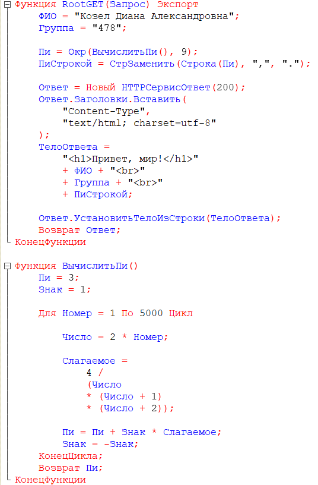
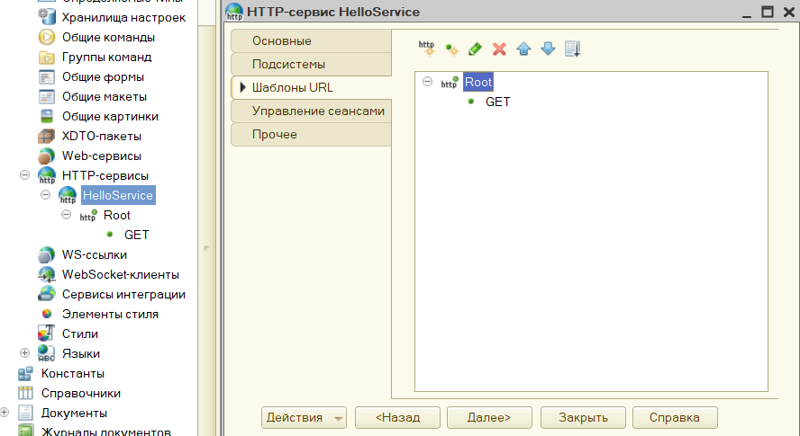
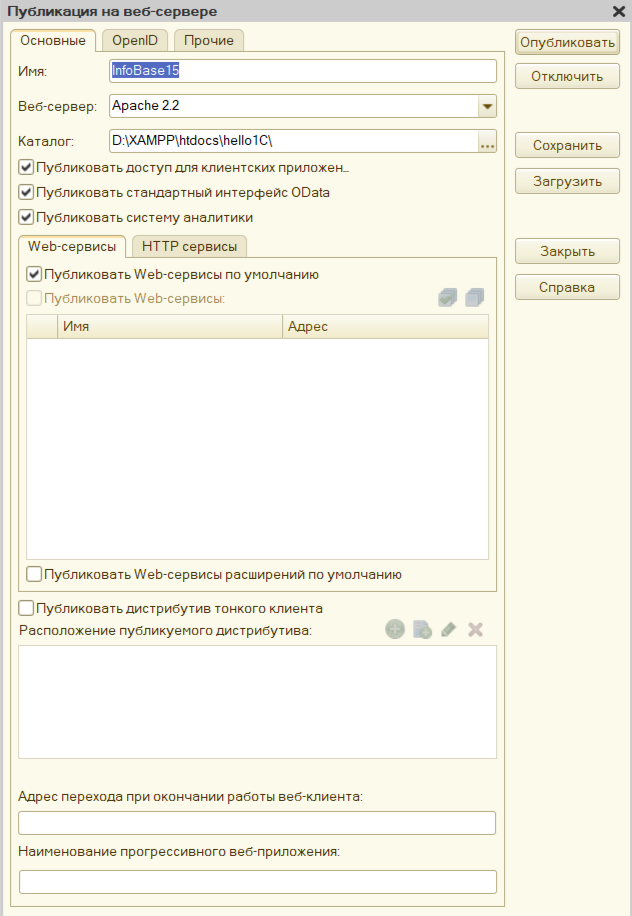
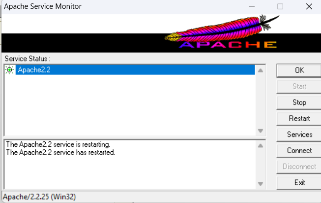

# Лабораторная работа № 11 — HTTP-сервис 1С

Практическая реализация задания «Привет, мир!» и индивидуального задания в
1С:Предприятии. В методичке исходный вариант написан для Node.js; в этой
работе аналогичное веб-приложение реализовано через HTTP-сервис 1С и
Apache 2.2.

## Результат

HTTP-обработчик `GET` возвращает HTML-страницу с:

1. заголовком «Привет, мир!»;
2. ФИО: Кизел Диана Александровна;
3. группой: 478;
4. значением числа π, рассчитанным по формуле Нилаканты без библиотек.

Исходный модуль в читаемой кодировке UTF-8:
[`src/HelloServiceModule.bsl`](src/HelloServiceModule.bsl).

## Использованные средства

- 1С:Предприятие 8.3 (учебная версия);
- HTTP-сервис `HelloService`;
- шаблон URL `Root`, метод `GET`;
- Apache 2.2 и веб-расширение 1С `wsap22t.dll`.

## Ход выполнения

1. В конфигураторе создан HTTP-сервис `HelloService`.
2. В разделе «Шаблоны URL» создан шаблон `Root`, для него выбран метод
   `GET`. Обработчик в модуле — экспортная функция `RootGET`.
3. В модуль добавлены формирование HTML-ответа и функция `ВычислитьПи()`.
   Она суммирует 5000 членов ряда Нилаканты, затем результат округляется до
   девяти знаков после запятой.
4. Конфигурация сохранена и обновлена в базе данных (`F7`).
5. База опубликована на Apache 2.2. Имя публикации формирует часть URL:
   `http://localhost/<ИмяПубликации>/hs/hello/`.
6. После публикации Apache перезапущен через Apache Service Monitor.

> На снимке публикации указано имя `InfoBase15`; в другой установке оно может
> быть `InfoBase`. Поэтому в адресе следует использовать именно то имя, которое
> задано в поле «Имя» окна публикации.

## Скриншоты

| Что подтверждает | Снимок |
| --- | --- |
| Код модуля HTTP-сервиса |  |
| Шаблон URL `Root` и метод `GET` |  |
| Настройки публикации на Apache 2.2 |  |
| Успешный перезапуск Apache2.2 |  |

## Структура веток

- `main` — базовый вариант «Привет, мир!»;
- `feature/student-info` — индивидуальное задание с данными студента и
  вычислением π. Эта ветка предназначена для Pull Request в `main`.

Файл резервной копии базы `1Cv8.dt` намеренно не добавлен: это бинарный файл
1С, в котором исходный код неудобно просматривать. В репозитории вместо него
есть исходник `.bsl` и снимки всех ключевых этапов.
